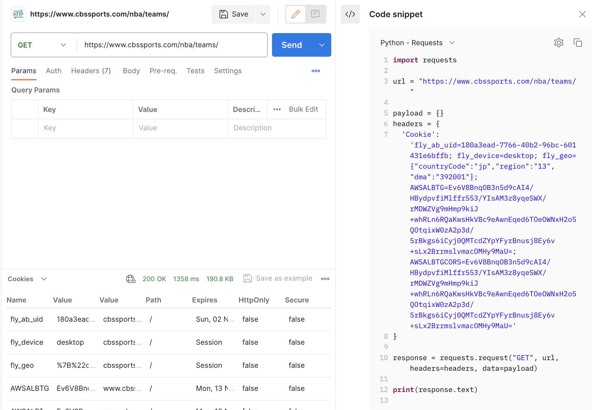

# sorare nba up tool

Working for 23-24 season

## install

1. install poetry, then use `poetry install` to install dependencies
2. install JAVA environment
3. set PROXY in `.env` if you need proxy to request, like `PROXY='http://127.0.0.1:7890'`
4. set COOKIES='fly_ab_uid=....' in `.env` to get NBA data, you can get it from postman: GET `https://www.cbssports.com/nba/teams/`
   

## search in your cards

0. set proxies in config/config.py if your need proxy to request
1. `poetry run python query_all_cards.py` will request all your cards and save in data folder
2. `poetry run python query_position_players.py` will request all player current position (once a week)
3. `poetry run python query_injure_and_match.py` will request all injure and matches in data folder (once a week)
4. change `config/config.py` if need, then `poetry run python compute.py` will compute results.txt to data folder

PS: It is recommended to get the latest injury report within 20 minutes of the end of the game week

## search in all nba players

1. `poetry run python query_all_players.py` will query all nba players and save in data folder (once a week)
2. `poetry run python query_position_players.py` will request all player current position (once a week)
3. `poetry run python query_injure_and_match.py` will request all injure and matches in data folder (once a week)
4. change `config/config.py` if need, then `poetry run python compute.py -r True` will compute results.txt to data folder

## invite link

[https://sorare.pxf.io/scriptmoney](https://sorare.pxf.io/scriptmoney)
